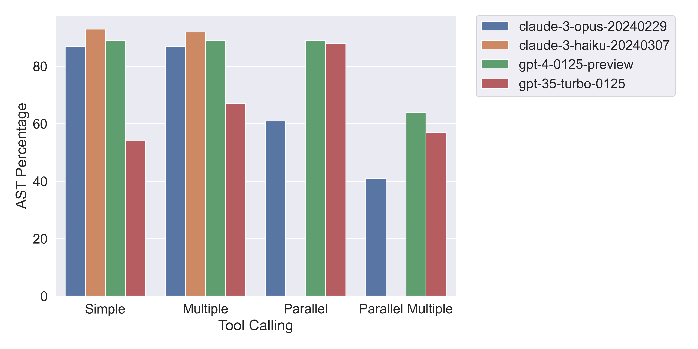

# Benchmarking Anthropic's Tool Use Beta API

You can see a discussion of the results in the [blog post](https://docs.parea.ai/blog/benchmarking-anthropic-beta-tool-use) and the details of the experiments [here](https://app.parea.ai/public-experiments/parea/tool-calling-benchmark/).

TL;DR:
- Haiku is the best model for tool use when only a single function call should be generated.
- However, when you need parallel tool use, GPT-4 Turbo is still the best model. 
- Noteworthy, GPT-3.5 Turbo appears biased towards generating multiple function calls in parallel, no matter if that’s required or not.



## Prepare Data

Following the [Gorilla repo](https://github.com/ShishirPatil/gorilla/tree/main/berkeley-function-call-leaderboard#prepare-evaluation-dataset), download the data from HuggingFace to the `./data` folder:

```bash
huggingface-cli download gorilla-llm/Berkeley-Function-Calling-Leaderboard --local-dir ./data --repo-type dataset
```

Then, manually download the [possible answers](https://github.com/ShishirPatil/gorilla/tree/main/berkeley-function-call-leaderboard/data/possible_answer) into `data/possible_answer`.

## Reproduce Results

1. Install the requirements: `pip install -r requirements.txt`
2. Get a Parea API key from [here](https://parea.ai/).
3. Copy the `.env.example` file to `.env` and fill in the API keys for Parea, OpenAI & Anthropic.
4. Run the experiments: `python3 experiment.py`
